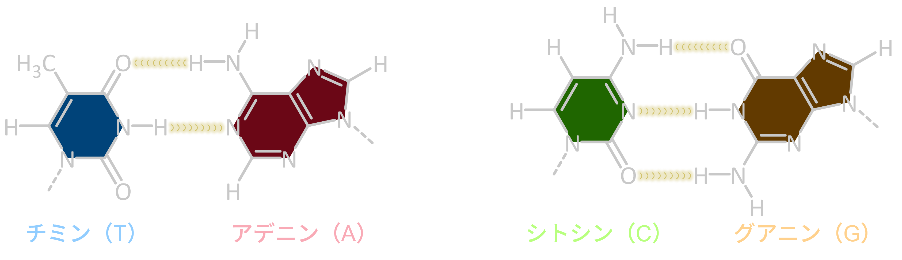

# 水素結合：分子をつなぐための基本部品

超分子ポリマーは、共有結合ではなく「弱い相互作用」でつながる。  
その中でも、水素結合は初期から最も多く使われている相互作用である。

なぜなら、水素結合は

- そこそこ強い  
- 方向性がある  
- 設計しやすい  

という、超分子構造を作るうえで都合の良い特徴を持つからだ。

---

## 水素結合とは何か

ざっくり言えば

- **水素（H）を介して**
- **電子を引きつける原子（O, N など）同士が**
- **引き合う相互作用**

である。

---

## なぜ水素結合が使いやすいのか

### 1) 方向性がある
水素結合は、単に「近いと強い」だけではない。  
**向きがそろうと強くなる**という特徴がある。
この性質のおかげで、分子同士が集まったときに特定の形をとりやすくなる。  

### 2) 強さがちょうどいい
共有結合ほど強くなく、熱揺らぎで切れることもある。  
でも弱すぎてすぐバラバラになるほどでもない。  
この中間的な強さが、**可逆な連結**を可能にする。

### 3) 足し算が効く（多重結合）
水素結合は1本だけだとほどほどでも、  
2本、3本…と揃うと、全体としてかなり強くなる。

---

## “設計できる水素結合”という発想

水素結合は、分子設計に落とし込みやすい。

たとえば

- アミド
- ウレア
- バルビツール酸、ウレイドピリミジノン（UPy）などの多点水素結合モチーフ
- カルボン酸（二量体形成）
- 2,6-ジアミドピリジンのようなパターン認識

など、相手の形を選ぶ「認識モチーフ」として設計できる。

重要なのは、  
水素結合をただの引力としてだけではなく、**鍵と鍵穴のような結合ルール**としても使える点だ。

---

## 水素結合は「溶媒」に影響される

水素結合は便利だが、扱いが難しい面もある。  
最大の理由は、**溶媒が水素結合に割り込む**ことだ。

### 無～低極性溶媒の場合
水素結合が効きやすい。  
そのため、水素結合を利用した超分子ポリマーを作りやすい。

### アルコール類、水の場合
水素結合することができるので、分子同士の水素結合を

- 競合して壊す  
- 置き換える  

ことが起こりやすい。

だから極性溶媒系で超分子ポリマーを作るのは難しい。  
水中では、水素結合だけに頼らず

- 疎水効果
- 静電相互作用
- 多点結合
- 金属配位

などの他の相互作用を組み合わせる戦略が必要になりがちだ。

---

## どの測定で水素結合がはたらいていることを確かめるか

- **FT-IR**：N–H や C=O 伸縮振動の吸収波長が変化する  
- **^1^H-NMR**：N–Hプロトンの化学シフトが低磁場シフトする

詳しくは、後の測定手法のページで具体的に扱う。

---

## まとめ

- 水素結合は、超分子ポリマーを作るための代表的な“つなぎ”  
- 方向性があり、多点化で設計できる  
- ただし溶媒に強く影響され、特に水中では競合が起こりやすい

---

## 次に読む
- [π–π 相互作用](pi-pi.md)
- [IR と水素結合](../characterization/ir.md)
