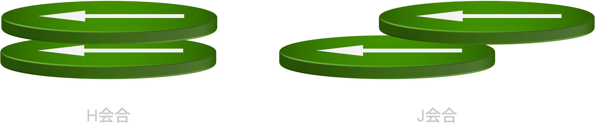

# π–π 相互作用：平面どうしが積み重なる力

π–π 相互作用は、芳香環や色素分子などの **π電子を持つ平面**どうしが近づいたときに生じる相互作用である。  
超分子ポリマーの世界では、π–π 相互作用は

- 分子を「積層」させる  
- 電子状態を「結合」させる（吸収や発光が変わる）  

という意味で、水素結合と並ぶ重要パーツになる。

---

## トランプみたいに重なる

芳香環は平たい。  
平たい分子がたくさんあると、近づいたときに「面どうし」がそろって積み重なりやすい。

ただし、教科書的な“完全な平行重なり”がいつも最適というわけではない。  
現実には

- 少しずらして重なる（スリップスタック）
- T字型に近い配置
- ねじれて積層する

など、いろいろな幾何が出る。

---

## π–π 相互作用は何で決まるのか

π–π 相互作用は一言で説明しづらいが、少なくとも次が同時に関わる。

- 分散力（ファンデルワールス）  
- 電荷分布（四重極、静電的な寄与）  
- 分子の形・置換基  
- 溶媒  
- 複数枚の積層による協同性

入口としては、こう覚えるのが実用的だ。

> **π平面が近づくと、積層した方が得になる条件がある。**  
> **その条件を分子設計で作ると、一次元に伸びる集合体ができやすい。**

---

## 具体的に何ができるのか

### 1) 一次元成長
π–π 相互作用は、分子が上下に積み重なることで一次元に成長しやすい。  
とくに色素やπ共役系は、積層がそのまま繊維やテープ状集合体につながることが多い。

### 2) 光学特性が強く変わる
π–π 積層が起こると、電子状態が互いに影響し合い（励起子カップリング）、

- 吸収スペクトルのシフト
- バンド形状の変化
- 発光の消光・増強
- 特徴的なCDシグナルの発現

などが起こる。

だから π–π 相互作用でできる超分子ポリマーは、UV/Vis や CD で状態を追いやすい。

---

## 超分子ポリマーでよく使う2つの積層様式

超分子ポリマー形成のために使われる π–π 相互作用には大きく2種類ある（図1）。  
厳密にはさらに多くの種類が存在するが、ひとまず次の理解で十分役に立つ。

### H型（H-aggregate）
- 分子が真正面に重なる。  
- 吸収が高エネルギー側（短波長側）へ寄り、吸収強度は減少しつつブロード化する。
- 発光強度が弱くなったり、消光したりすることがある。

### J型（J-aggregate）
- 分子がずれて積層する。（厳密には、遷移双極子モーメントが揃ったままずれる）
- 吸収が低エネルギー側（長波長側）へ寄り、吸収強度が増しつつ吸収帯は先鋭化する。  
- 発光強度が強くなることがある。

> 図1. H会合とJ会合の模式図。矢印は遷移双極子モーメントを表す。

---

## π–π 相互作用の弱点：芳香族溶媒と競合しやすい

π–π 相互作用は、溶媒効果とセットで考える必要がある。

- 溶媒がπ平面に強く相互作用する（芳香族溶媒など）と、積層が弱まることがある  
- 極性溶媒では、静電的な寄与や溶媒和で配列が変わることがある  
- 水中では疎水効果と組み合わさって強く見えることもある

---

## まとめ

- π–π 相互作用は、π平面同士が積層することで一次元成長を導く重要因子  
- 分光特性（UV/Vis、CD）を強く変えるため、集合の指標として使いやすい  
- 積層様式は主に2種類存在する（H会合/J会合）

---

## 次に読む
- [疎水効果と溶媒](hydrophobic-effect.md)
- [円二色性（CD）](../characterization/cd.md)
